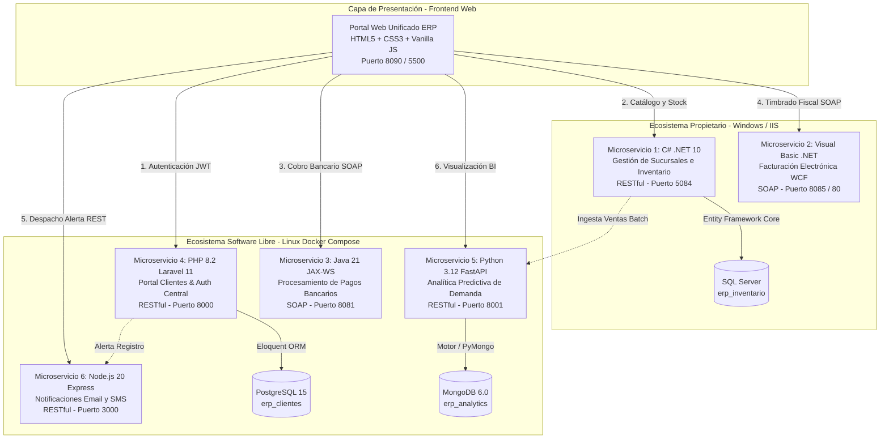
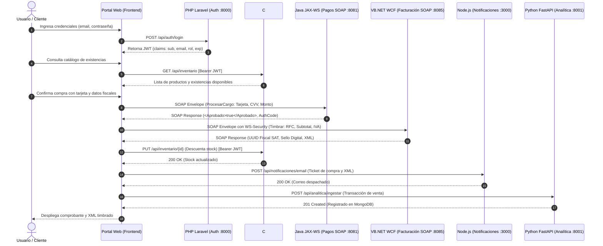
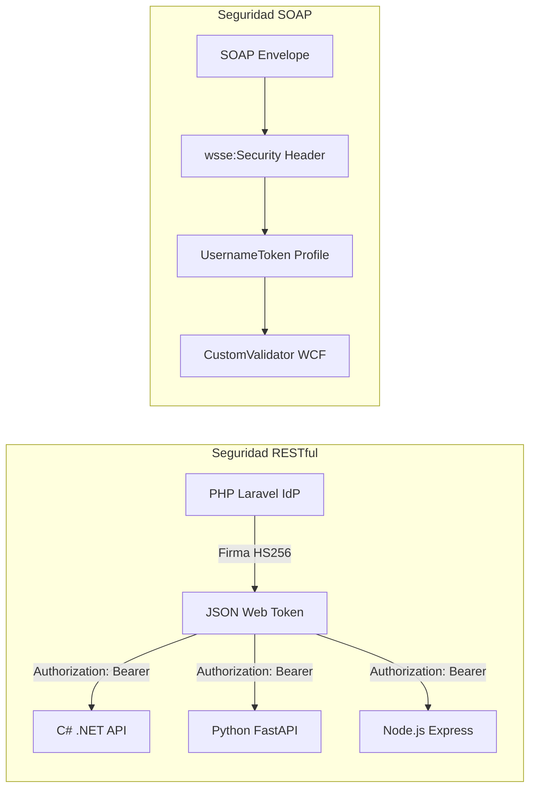

# Sistema ERP Retail Distribuido e Interoperable

> Plataforma modular de microservicios heterogéneos que integra arquitecturas **RESTful (JSON)** y **SOAP (XML)** a través de 6 servicios independientes desarrollados en C#, VB.NET, Java, PHP, Python y Node.js, orquestados en contenedores Docker y Windows Server.

---

[-blue.svg)](#)
[](#)
[](#)
[%20%7C%20WS--Security-red.svg)](#)
[](#)

---

## 📑 Tabla de Contenidos

1. [Visión General del Sistema](#1-visión-general-del-sistema)
2. [Matriz Tecnológica y Responsabilidades](#2-matriz-tecnológica-y-responsabilidades)
3. [Flujo de Negocio Transaccional (End-to-End)](#3-flujo-de-negocio-transaccional-end-to-end)
4. [Estructura del Repositorio](#4-estructura-del-repositorio)
5. [Requisitos Previos](#5-requisitos-previos)
6. [Guía de Configuración y Variables de Entorno](#6-guía-de-configuración-y-variables-de-entorno)
7. [Puesta en Marcha y Despliegue](#7-puesta-en-marcha-y-despliegue)
8. [Uso de la Aplicación y Portal Web](#8-uso-de-la-aplicación-y-portal-web)
9. [Catálogo de APIs y Guía de Pruebas](#9-catálogo-de-apis-y-guía-de-pruebas)
10. [Modelo de Seguridad y Autenticación](#10-modelo-de-seguridad-y-autenticación)
11. [Comparativa Técnica: REST (JSON) vs. SOAP (XML)](#11-comparativa-técnica-rest-json-vs-soap-xml)
12. [Licencia](#12-licencia)

---

## 1. Visión General del Sistema

En entornos corporativos reales, es común que convivan sistemas modernos en la nube con plataformas heredadas (*legacy*) de misión crítica. Este proyecto implementa una solución de arquitectura distribuida para una cadena de **Retail Empresarial (ERP)**, simulando la interacción entre dos grandes ecosistemas:

* **Ecosistema Propietario (Windows / IIS / Kestrel):** Aloja el inventario corporativo de alto rendimiento (.NET) y la facturación fiscal estructurada (WCF con WS-Security) conectados a Microsoft SQL Server.
* **Ecosistema de Software Libre (Linux / Docker):** Aloja la pasarela de pagos transaccional (Java JAX-WS), el portal de identidad y clientes (PHP Laravel), el motor de analítica predictiva (Python FastAPI con MongoDB) y la mensajería asíncrona (Node.js Express).
* **Capa Cliente Unificada (Frontend):** Una Single Page Application (SPA) construida en JavaScript moderno capaz de orquestar de forma transparente tanto peticiones REST con cabeceras Bearer como sobres XML SOAP con deserialización en el navegador.



---

## 2. Matriz Tecnológica y Responsabilidades

Cada lenguaje y framework fue seleccionado estratégicamente aprovechando sus fortalezas naturales en la industria de software:

| Microservicio | Lenguaje / Framework | Paradigma | Protocolo / Formato | Puerto | Almacenamiento | Responsabilidad Principal |
| :--- | :--- | :--- | :--- | :--- | :--- | :--- |
| **Gestión e Inventario** | C# .NET 10 (ASP.NET Core) | RESTful | HTTP / JSON | `5084` | SQL Server | CRUD de existencias por sucursal, catálogo corporativo y validación de stock. |
| **Facturación Electrónica** | VB.NET (WCF / CoreWCF) | SOAP | HTTP POST / XML | `8085` | Almacén XML | Generación de comprobante fiscal digital CFDI, firma digital y seguridad WS-Security. |
| **Procesamiento de Pagos** | Java 21 LTS (JAX-WS / Metro) | SOAP | HTTP POST / XML | `8081` | En memoria / ACID | Pasarela transaccional bancaria regida por contrato estricto WSDL. |
| **Portal Clientes & Auth** | PHP 8.2 (Laravel 11) | RESTful | HTTP / JSON | `8000` | PostgreSQL 15 | Emisor central de identidad (IdP), hash seguro de credenciales y expedición de JWT. |
| **Analítica y Predicción** | Python 3.12 (FastAPI) | RESTful | HTTP / JSON | `8001` | MongoDB 6.0 | Ingesta masiva de compras y cálculo de pronósticos de demanda a 7 días vista. |
| **Notificaciones** | Node.js 20 (Express.js) | RESTful | HTTP / JSON | `3000` | Stateless (SMTP) | Envío asíncrono no bloqueante de recibos por correo electrónico y mensajes SMS. |
| **Portal Web ERP** | HTML5 / CSS3 / Vanilla JS | SPA | Fetch / DOMParser | `8090` | LocalStorage | Interfaz administrativa de compras con orquestador visual de transacciones. |

---

## 3. Flujo de Negocio Transaccional (End-to-End)

El siguiente diagrama detalla la orquestación secuencial ejecutada al confirmar una compra en el sistema:



---

## 4. Estructura del Repositorio

El proyecto está organizado en una estructura monorepo desacoplada:

```text
├── backend/
│   ├── docker-compose.yml           # Orquestación del stack Linux y bases de datos
│   │
│   ├── csharp-inventario/           # Microservicio 1: C# .NET 10 (REST)
│   │   ├── Controllers/             # Controladores REST de Inventario y Productos
│   │   ├── Data/                    # DbContext Entity Framework Core
│   │   ├── Models/                  # Entidades y DTOs de transferencia
│   │   └── Program.cs               # Configuración de Kestrel, CORS y JWT Bearer
│   │
│   ├── vbnet-facturacion/           # Microservicio 2: VB.NET WCF (SOAP)
│   │   ├── IFacturacion.vb          # Contrato de servicio WCF
│   │   ├── FacturacionService.svc.vb# Lógica de timbrado fiscal
│   │   └── Web.config               # Configuración de bindings y WS-Security
│   │
│   ├── java-pagos/                  # Microservicio 3: Java 21 JAX-WS (SOAP)
│   │   ├── src/main/java/com/erp/pagos/ # Servicio JAX-WS y modelos de cargo
│   │   ├── pom.xml                  # Dependencias Maven Jakarta XML WS
│   │   └── Dockerfile
│   │
│   ├── php-clientes/                # Microservicio 4: PHP 8.2 Laravel 11 (REST)
│   │   ├── app/Http/Controllers/    # Controladores de Auth (JWT) y Clientes
│   │   ├── routes/api.php           # Definición de rutas RESTful
│   │   └── Dockerfile
│   │
│   ├── python-analitica/            # Microservicio 5: Python 3.12 FastAPI (REST)
│   │   ├── app/routers/analitica.py # Ingesta y algoritmos de demanda
│   │   ├── requirements.txt         # Dependencias Python (FastAPI, Motor, PyMongo)
│   │   └── Dockerfile
│   │
│   └── node-notificaciones/         # Microservicio 6: Node.js 20 Express (REST)
│       ├── src/server.js            # Servidor Express y despacho de correo/SMS
│       └── Dockerfile
│
├── database/                        # Scripts de inicialización de datos
│   ├── inventario_sqlserver.sql     # Esquema DDL para SQL Server
│   ├── clientes_postgres.sql        # Esquema y semillas para PostgreSQL
│   └── mongo_init.js                # Colecciones iniciales para MongoDB
│
├── frontend/                        # Portal Web Unificado (SPA)
│   ├── index.html                   # Interfaz de usuario con stepper en vivo
│   ├── css/                         # Hoja de estilos moderna y diseño responsivo
│   └── js/                          # Clientes HTTP, generador SOAP y orquestador
│
├── start_backend_windows.ps1        # Script de inicio automatizado (Windows)
├── stop_backend_windows.ps1         # Script de apagado automatizado (Windows)
├── start_backend_linux.sh           # Script de inicio automatizado (Linux/macOS)
└── stop_backend_linux.sh            # Script de apagado automatizado (Linux/macOS)
```

---

## 5. Requisitos Previos

Asegúrate de contar con las siguientes herramientas instaladas en tu sistema:

* **Docker & Docker Compose** (versión 24 o superior).
* **.NET SDK 8.0 o 10.0** (necesario para compilar y ejecutar C# e inventario localmente).
* **Git** para clonar el repositorio.
* Opcional para pruebas avanzadas: **Postman**, **SoapUI** o **cURL**.

---

## 6. Guía de Configuración y Variables de Entorno

Los microservicios utilizan variables de entorno centralizadas para evitar exponer credenciales o configuraciones fijas.

### 6.1. Variables de Entorno en Docker (`backend/docker-compose.yml`)

El archivo compose define los siguientes valores por defecto para pruebas locales. En entornos de producción, configura estas variables mediante un archivo `.env`:

```bash
# PostgreSQL (Auth & Clientes)
POSTGRES_USER=erp_user
POSTGRES_PASSWORD=tu_password_seguro_postgres
POSTGRES_DB=erp_clientes

# MongoDB (Analítica BI)
MONGO_URL=mongodb://mongo-db:27017
MONGO_DB=erp_analytics

# Clave Secreta Compartida para validación de JWT (Mínimo 32 caracteres)
JWT_SECRET=TuClaveSecretaCompartidaParaFirmaDeTokensJWT2026!

# Configuración SMTP de Notificaciones
SMTP_HOST=smtp.mailtrap.io
SMTP_PORT=2525
```

### 6.2. Configuración de C# .NET (`backend/csharp-inventario/appsettings.json`)

```json
{
  "ConnectionStrings": {
    "DefaultConnection": "Server=localhost;Database=erp_inventario;Trusted_Connection=True;TrustServerCertificate=True;"
  },
  "Jwt": {
    "Key": "TuClaveSecretaCompartidaParaFirmaDeTokensJWT2026!"
  }
}
```

---

## 7. Puesta en Marcha y Despliegue

### Opción A: Inicio Automatizado con Scripts (Recomendado)

#### En Windows (PowerShell):
Abre una ventana de PowerShell en la raíz del proyecto y ejecuta:
```powershell
.\start_backend_windows.ps1
```
*El script verificará dependencias, construirá las imágenes de Docker, iniciará los contenedores de Linux y lanzará el servicio de C# en una terminal independiente.*

Para iniciar el frontend:
```powershell
.\start_frontend_windows.ps1
```

Para detener todos los servicios de forma limpia:
```powershell
.\stop_backend_windows.ps1
.\stop_frontend_windows.ps1
```

#### En Linux / macOS / WSL (Bash):
```bash
chmod +x *.sh
./start_backend_linux.sh
./start_frontend_linux.sh
```

---

### Opción B: Inicio Manual por Capas

#### 1. Iniciar los Servicios en Docker:
```bash
cd backend
docker compose up -d --build
```
Verifica que los 6 contenedores estén saludables:
```bash
docker compose ps
```

#### 2. Iniciar el Servicio C# .NET 10:
En una terminal separada:
```bash
cd backend/csharp-inventario
dotnet run
```
*El servicio escuchará en `http://localhost:5084`.*

#### 3. Iniciar el Servicio VB.NET WCF (Opcional si usas IIS):
Publica la carpeta `backend/vbnet-facturacion` en IIS asignando el puerto `8085` o `80`.  
*(Nota: Si no dispones de IIS local, el portal Frontend incluye un adaptador de contingencia que permite simular la respuesta SOAP de facturación sin interrumpir las pruebas).*

#### 4. Abrir la Aplicación Web:
Puedes servir los archivos estáticos de la carpeta `frontend/` mediante cualquier servidor HTTP:
```bash
# Con npx
npx serve ./frontend -p 8090

# O con Python
python -m http.server 8090 --directory ./frontend
```
Accede en tu navegador a: **`http://localhost:8090`**.

---

## 8. Uso de la Aplicación y Portal Web

1. **Autenticación:** Inicia sesión con las credenciales demo precargadas (`cliente@retail.com` / `Password123!`). El sistema obtendrá un token JWT emitido por Laravel y lo almacenará en el navegador.
2. **Exploración de Catálogo:** Consulta los productos cargados desde el servicio de C# .NET con su stock por sucursal.
3. **Carrito de Compras:** Agrega productos y ajusta cantidades.
4. **Proceso de Compra:** Al hacer clic en *"Proceder a la Compra"*, el stepper transaccional ejecutará en vivo:
   - Cobro bancario vía **SOAP (Java)**.
   - Timbrado de factura vía **SOAP (VB.NET)**.
   - Descuento de stock vía **REST (C#)**.
   - Envío de comprobante por correo vía **REST (Node.js)**.
   - Registro de transacción en **MongoDB vía REST (FastAPI)**.
5. **Visor de Factura Fiscal:** Al finalizar, podrás inspeccionar el archivo XML timbrado con su sello digital y folio fiscal (UUID).
6. **Módulo de Analítica:** Visualiza el tablero con predicciones de demanda calculadas por Python para cada producto.

---

## 9. Catálogo de APIs y Guía de Pruebas

### 9.1. Pruebas de Servicios RESTful (cURL)

#### 1. Login y Obtención de Token JWT (PHP Laravel)
```bash
curl -X POST http://localhost:8000/api/auth/login \
  -H "Content-Type: application/json" \
  -d '{
    "email": "cliente@retail.com",
    "password": "Password123!"
  }'
```
*Respuesta (200 OK):*
```json
{
  "access_token": "eyJhbGciOiJIUzI1NiIsInR5cCI6IkpXVCJ9...",
  "token_type": "bearer",
  "expires_in": 3600,
  "user": { "id": 1, "nombre": "Juan Pérez", "puntos_lealtad": 120 }
}
```

#### 2. Consulta de Inventario (C# .NET 10)
```bash
curl -X GET "http://localhost:5084/api/inventario?sucursalId=1" \
  -H "Authorization: Bearer <TU_TOKEN_JWT>"
```

#### 3. Actualización de Existencias (C# .NET 10)
```bash
curl -X PUT http://localhost:5084/api/inventario/3fa85f64-5717-4562-b3fc-2c963f66afa6 \
  -H "Content-Type: application/json" \
  -H "Authorization: Bearer <TU_TOKEN_JWT>" \
  -d '{"cantidad": 40}'
```

#### 4. Ingesta de Venta para Analítica (Python FastAPI)
```bash
curl -X POST http://localhost:8001/api/analitica/ingestar \
  -H "Content-Type: application/json" \
  -d '[{
    "ventaId": "V-2026-001",
    "clienteId": 1,
    "sku": "LAP-GAM-001",
    "sucursalId": 1,
    "cantidad": 1,
    "precioTotal": 1299.99,
    "timestamp": "2026-09-13T20:15:00Z"
  }]'
```

#### 5. Consulta de Tendencias y Reabastecimiento (Python FastAPI)
```bash
curl -X GET "http://localhost:8001/api/analitica/tendencias?sucursalId=1&dias_horizonte=7"
```

---

### 9.2. Pruebas de Servicios SOAP (SoapUI o cURL)

#### 1. Procesar Cargo Bancario (Java JAX-WS)
* **Endpoint:** `http://localhost:8081/ws/pagos`
* **WSDL:** `http://localhost:8081/ws/pagos?wsdl`
* **Cabecera:** `Content-Type: text/xml; charset=utf-8`

```xml
<soapenv:Envelope xmlns:soapenv="http://schemas.xmlsoap.org/soap/envelope/" xmlns:pag="http://pagos.erp.com/">
   <soapenv:Header/>
   <soapenv:Body>
      <pag:ProcesarCargo>
         <NumeroTarjeta>4111111111111111</NumeroTarjeta>
         <CVV>123</CVV>
         <Monto>1299.99</Monto>
         <FechaExpiracion>12/28</FechaExpiracion>
      </pag:ProcesarCargo>
   </soapenv:Body>
</soapenv:Envelope>
```

#### 2. Timbrado Fiscal con WS-Security (VB.NET WCF)
* **Endpoint:** `http://localhost:8085/FacturacionService.svc`
* **WSDL:** `http://localhost:8085/FacturacionService.svc?wsdl`

```xml
<soapenv:Envelope xmlns:soapenv="http://schemas.xmlsoap.org/soap/envelope/" xmlns:fac="http://erp.retail.com/facturacion">
   <soapenv:Header>
      <wsse:Security xmlns:wsse="http://docs.oasis-open.org/wss/2004/01/oasis-200401-wss-wssecurity-secext-1.0.xsd">
         <wsse:UsernameToken>
            <wsse:Username>erp_admin</wsse:Username>
            <wsse:Password>TuPasswordWSSecurity!</wsse:Password>
         </wsse:UsernameToken>
      </wsse:Security>
   </soapenv:Header>
   <soapenv:Body>
      <fac:Timbrar>
         <fac:request>
            <fac:RfcReceptor>XAXX010101000</fac:RfcReceptor>
            <fac:RazonSocial>Publico General</fac:RazonSocial>
            <fac:MontoTotal>1299.99</fac:MontoTotal>
            <fac:Subtotal>1120.68</fac:Subtotal>
            <fac:Iva>179.31</fac:Iva>
            <fac:Conceptos>
               <fac:ConceptoItem>
                  <fac:Cantidad>1</fac:Cantidad>
                  <fac:Descripcion>Laptop Gamer 15 pulgadas</fac:Descripcion>
                  <fac:PrecioUnitario>1120.68</fac:PrecioUnitario>
               </fac:ConceptoItem>
            </fac:Conceptos>
         </fac:request>
      </fac:Timbrar>
   </soapenv:Body>
</soapenv:Envelope>
```

---

## 10. Modelo de Seguridad y Autenticación



1. **Seguridad REST (JWT Compartido):**
   - El emisor central en PHP genera tokens firmados mediante HMAC SHA-256 (`HS256`).
   - Los microservicios de C#, Python y Node.js validan la firma de forma desacoplada mediante la clave simétrica compartida sin realizar consultas redundantes a la base de datos de usuarios.
2. **Seguridad SOAP (WS-Security):**
   - El servicio WCF exige la presencia de credenciales estructuradas dentro del encabezado `<wsse:Security>` mediante el perfil estándar `UsernameToken`.
3. **Aislamiento de Infraestructura:**
   - Bases de datos aisladas en la red interna privada `erp_network` sin exposición indebida de puertos al exterior.
   - Cabeceras CORS configuradas para permitir exclusivamente el consumo desde el origen autorizado del frontend.

---

## 11. Comparativa Técnica: REST (JSON) vs. SOAP (XML)

| Criterio / Dimensión | Arquitectura RESTful | Arquitectura SOAP |
| :--- | :--- | :--- |
| **Naturaleza** | Estilo arquitectónico sobre HTTP | Protocolo de comunicación formal y estricto (W3C/OASIS) |
| **Formato de Datos** | Predominantemente **JSON** (ligero, clave-valor) | Exclusivamente **XML** estructurado con sobres y namespaces |
| **Contrato de Interfaz** | Opcional (OpenAPI / Swagger) | **Obligatorio** y tipado formalmente mediante **WSDL / XSD** |
| **Métodos y Operaciones** | Semánticos: `GET`, `POST`, `PUT`, `PATCH`, `DELETE` | Exclusivamente `HTTP POST` con la operación en el Envelope |
| **Capa de Seguridad** | Nivel de transporte (**TLS/HTTPS**) + Tokens (**JWT**) | Nivel de mensaje (**WS-Security**, firma y encriptación XML) |
| **Overhead de Red** | **Bajo** (payloads compactos de rápida serialización) | **Alto** (sobrecarga por etiquetas XML y namespaces repetidos) |
| **Consumo en Frontend** | Nativo y directo mediante `fetch()` y `JSON.parse()` | Requiere construcción manual de envelopes XML y parsers DOM |
| **Herramienta de Diagnóstico** | Postman, cURL, Insomnia, Swagger UI | SoapUI, WcfTestClient, cURL con payload XML |
| **Casos de Uso Ideales** | Portales web, aplicaciones móviles, microservicios ágiles | Banca, transferencias interbancarias, facturación fiscal tributaria |

---

## 12. Licencia

Este proyecto se distribuye bajo la licencia **MIT**. Consulta el archivo `LICENSE` para obtener más información.
