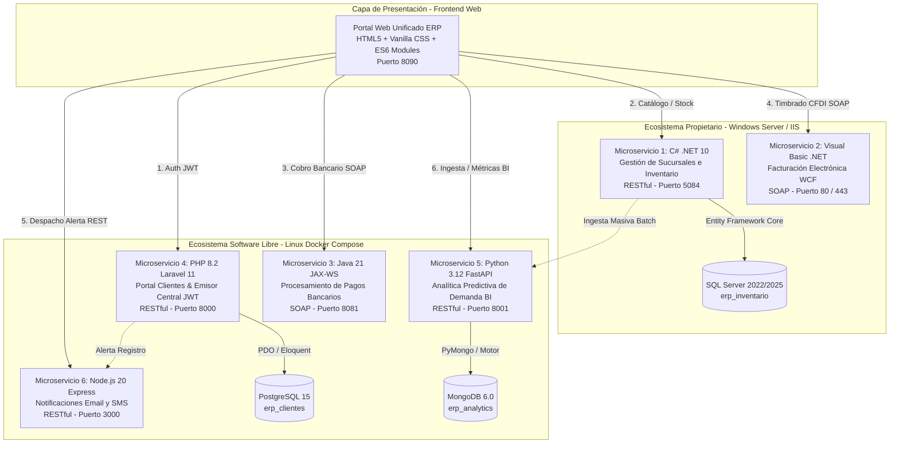
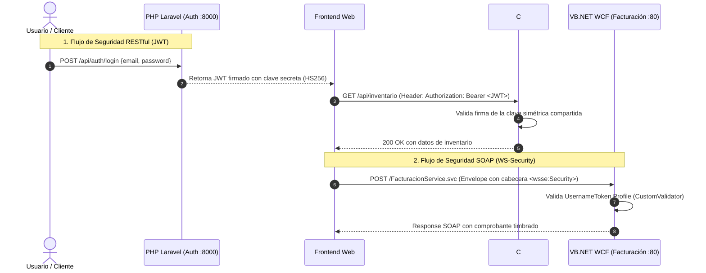
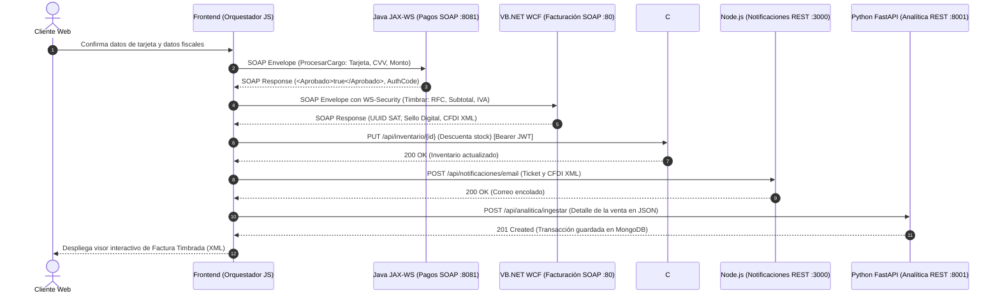

# Sistema ERP Retail Distribuido (v2)
## Implementación, Publicación y Comparativa de Servicios Web Heterogéneos (SOAP y RESTful)

[-blue.svg)](#)
[](#)
[](#)
[%20%7C%20WS--Security-red.svg)](#)

---

## 1. Introducción y Objetivos de la Práctica

Este proyecto tiene como objetivo el **diseño, desarrollo, integración, publicación y evaluación comparativa** de un ecosistema distribuido de servicios web orientado a la resolución de un problema de negocio real: la operación de una cadena de tiendas de **Retail Empresarial (ERP)**.

El sistema fragmenta las responsabilidades del negocio (Catálogo e Inventarios, Facturación Fiscal, Pasarela de Pagos, Portal de Clientes y Autenticación, Analítica Predictiva de Demanda y Notificaciones) en **6 microservicios independientes pero interconectados**, implementados en **seis lenguajes de programación distintos**:
- **2 Tecnologías Propietarias:** C# (.NET 10) y Visual Basic .NET (WCF).
- **4 Tecnologías de Software Libre:** Java (Jakarta EE / JAX-WS), PHP (Laravel 11), Python (FastAPI) y Node.js (Express).

### Objetivos Alcanzados:
1. **Modelado y Solución de un Caso Real:** Simulación completa del ciclo de compra y gestión de existencias en tiendas físicas y virtuales.
2. **Implementación Exhaustiva de Paradigmas:**
   - **RESTful:** Métodos HTTP completos (`GET`, `POST`, `PUT`, `DELETE`), códigos de estado HTTP estandarizados (`200 OK`, `201 Created`, `204 No Content`, `400 Bad Request`, `401 Unauthorized`, `404 Not Found`, `409 Conflict`) e intercambio de datos en formato **JSON**.
   - **SOAP:** Definición estricta de contratos WSDL, esquemas XML/XSD, construcción de sobres `<soapenv:Envelope>` e intercambio de información mediante **XML**.
3. **Mecanismos de Seguridad Robusta:**
   - **Enfoque REST:** Firma y verificación distribuida de tokens **JWT (JSON Web Tokens)** con algoritmo simétrico HMAC SHA-256 (`HS256`).
   - **Enfoque SOAP:** Perfil de seguridad corporativo **WS-Security** (`UsernameToken Profile`).
4. **Publicación y Despliegue Multi-Plataforma:** Orquestación contenerizada con **Docker Compose** en Linux y despliegue sobre **Internet Information Services (IIS / Kestrel)** en Windows Server.
5. **Cliente Web Unificado (Frontend):** Aplicación cliente desarrollada en estándares web modernos (HTML5, Vanilla CSS y JavaScript ES6+ Modules) capaz de consumir tanto APIs REST como servicios SOAP directamente desde el navegador con un *stepper* transaccional en vivo.
6. **Pruebas y Documentación:** Documentación Swagger/OpenAPI y suites de prueba preparadas para herramientas de diagnóstico como Postman, SoapUI y cURL.

---

## 2. Marco Teórico: Comparativa Conceptual entre SOAP y RESTful

| Criterio | SOAP (Simple Object Access Protocol) | RESTful (Representational State Transfer) |
| :--- | :--- | :--- |
| **Definición** | Protocolo formal y estricto basado en estándares XML definidos por la W3C. | Estilo arquitectónico basado en los principios y métodos nativos de la web (HTTP). |
| **Formato de Datos** | Exclusivamente **XML** (estructurado mediante sobres SOAP). | Múltiples formatos; predominantemente **JSON**, aunque soporta XML, YAML, HTML y texto plano. |
| **Definición de Contrato** | **WSDL (Web Services Description Language)** estricto y tipado fuertemente. | Autodescriptivo; documentado mediante especificaciones abiertas como **OpenAPI / Swagger**. |
| **Protocolos de Transporte** | Independiente del transporte: HTTP, HTTPS, SMTP, JMS, TCP. | Acoplado principalmente a **HTTP / HTTPS**. |
| **Operaciones** | Orientado a RPC (*Remote Procedure Call*); verbos definidos en el cuerpo (ej. `Timbrar`, `ProcesarCargo`). | Orientado a recursos identificados por URIs y manipulados con verbos HTTP (`GET`, `POST`, `PUT`, `DELETE`). |
| **Manejo del Estado** | Puede ser State-full o Stateless dependiendo de la configuración del binding. | Completamente **Stateless** (sin estado entre peticiones). |
| **Mecanismos de Seguridad** | Estándar corporativo **WS-Security** (cifrado a nivel de mensaje, firmas digitales, tokens SAML/UsernameToken). | Seguridad a nivel de transporte (**HTTPS/TLS**) y tokens de aplicación (**JWT**, OAuth2, API Keys). |
| **Caché** | No almacenable en caché de forma nativa a nivel HTTP (las peticiones usan siempre `POST`). | Soporte nativo y directo para caché HTTP (`Cache-Control`, `ETag`). |
| **Ventajas** | - Contratos estrictos y tipado garantizado.<br>- Idóneo para entornos financieros, bancarios y fiscales de alta seguridad.<br>- Transaccionalidad ACID distribuida (WS-AtomicTransaction). | - Extremadamente ligero, flexible y de alto rendimiento.<br>- Curva de aprendizaje baja.<br>- Integración nativa e instantánea con navegadores y dispositivos móviles. |
| **Desventajas** | - Sintaxis verbosa y sobrecarga (*overhead*) de ancho de banda por el XML.<br>- Parsing pesado y complejidad de configuración.<br>- Difícil de consumir directamente desde JavaScript nativo sin librerías. | - Ausencia de contrato formal nativo a menos que se use OpenAPI.<br>- La seguridad a nivel de mensaje debe implementarse a nivel de capa de aplicación. |

---

## 3. Arquitectura del Proyecto y Matriz Tecnológica

El sistema implementa los 6 microservicios repartidos estratégicamente entre infraestructura propietaria e infraestructura de código abierto:



### Detalle de Tecnologías y Puertos Asignados

| Microservicio | Clasificación | Lenguaje / Runtime | Framework / API | Paradigma | Puerto | Base de Datos | Host de Despliegue |
| :--- | :--- | :--- | :--- | :--- | :--- | :--- | :--- |
| **Gestión e Inventario** | Propietario | C# / .NET 10 | ASP.NET Core Web API | **RESTful** | `5084` | SQL Server | Windows / IIS / Kestrel |
| **Facturación Electrónica**| Propietario | Visual Basic .NET | Windows Communication Foundation (WCF) | **SOAP** | `80` / `443` | Almacén XML | Windows Server 2025 (IIS) |
| **Procesamiento de Pagos** | Software Libre| Java 21 LTS | Jakarta XML Web Services (JAX-WS) | **SOAP** | `8081` | Transaccional en Memoria | Linux (Contenedor Docker) |
| **Portal Clientes & Auth** | Software Libre| PHP 8.2 | Laravel 11 (`tymon/jwt-auth`) | **RESTful** | `8000` | PostgreSQL 15 | Linux (Contenedor Docker) |
| **Analítica y Predicción** | Software Libre| Python 3.12 | FastAPI / Pydantic v2 | **RESTful** | `8001` | MongoDB 6.0 | Linux (Contenedor Docker) |
| **Notificaciones** | Software Libre| Node.js 20 | Express.js / Nodemailer | **RESTful** | `3000` | Stateless (SMTP) | Linux (Contenedor Docker) |
| **Portal Web Unificado** | Presentación | JavaScript ES6 | Web APIs nativas (`fetch`, DOMParser) | **Cliente Mixto**| `8090` | LocalStorage | Nginx / Servidor Estático |

---

## 4. Estructura de Directorios del Repositorio

La arquitectura del proyecto está organizada en un monorepo modular desacoplado:

```text
servicios-web/
├── README.md                             # Documento maestro integral del proyecto
├── arquitectura.md                       # Especificación arquitectónica global
├── backend.md                            # Especificación técnica detallada de backend
├── frontend.md                           # Especificación técnica detallada de frontend
├── especificaci_n_t_cnica_completa_erp_v2.md # Requerimiento y caso de estudio base
│
├── database/                             # Scripts DDL de inicialización de bases de datos
│   ├── inventario_sqlserver.sql          # Tablas Productos e Inventario para SQL Server
│   ├── clientes_postgres.sql             # Tabla clientes y semilla para PostgreSQL
│   └── mongo_init.js                     # Colecciones ventas y predicciones para MongoDB
│
├── backend/                              # Capa Backend con los 6 Microservicios
│   ├── docker-compose.yml                # Orquestador del stack Linux y bases de datos
│   │
│   ├── csharp-inventario/                # Microservicio 1: C# .NET 10 (REST)
│   │   ├── Controllers/InventarioController.cs # CRUD REST y Catálogo
│   │   ├── Data/InventarioDbContext.cs   # DbContext de Entity Framework Core
│   │   ├── Models/ (Producto.cs, Inventario.cs, DTOs/)
│   │   ├── Program.cs                    # Configuración de Kestrel :5084, CORS y JWT
│   │   ├── appsettings.json
│   │   └── InventarioApi.csproj
│   │
│   ├── vbnet-facturacion/                # Microservicio 2: VB.NET WCF (SOAP)
│   │   ├── IFacturacion.vb               # ServiceContract WCF
│   │   ├── FacturacionService.svc.vb     # Implementación de la operación Timbrar
│   │   ├── Models/ (GenerarFacturaRequest, GenerarFacturaResponse)
│   │   ├── Web.config                    # Configuración WS-Security en IIS
│   │   └── FacturacionWcf.vbproj
│   │
│   ├── java-pagos/                       # Microservicio 3: Java 21 JAX-WS (SOAP)
│   │   ├── src/main/java/com/erp/pagos/
│   │   │   ├── PagosWebService.java      # Interfaz @WebService
│   │   │   ├── PagosWebServiceImpl.java  # Operación ProcesarCargo
│   │   │   ├── PagosPublisher.java       # Publicador Endpoint.publish :8081
│   │   │   └── model/ (CargoRequest, CargoResponse)
│   │   ├── pom.xml                       # Dependencias Maven Jakarta XML WS
│   │   └── Dockerfile
│   │
│   ├── php-clientes/                     # Microservicio 4: PHP 8.2 Laravel 11 (REST)
│   │   ├── app/Http/Controllers/         # AuthController (JWT) y ClienteController
│   │   ├── app/Models/Cliente.php        # Modelo con JWTSubject
│   │   ├── routes/api.php                # Endpoints /api/auth/login, /api/clientes/*
│   │   ├── public/index.php              # Front Controller con firma HS256
│   │   ├── composer.json
│   │   └── Dockerfile
│   │
│   ├── python-analitica/                 # Microservicio 5: Python 3.12 FastAPI (REST)
│   │   ├── app/
│   │   │   ├── main.py                   # App FastAPI en puerto :8001
│   │   │   ├── database.py               # Conexión MongoDB / Memoria
│   │   │   ├── models/venta.py           # Esquemas Pydantic v2
│   │   │   └── routers/analitica.py      # Ingesta masiva y pronóstico de demanda
│   │   ├── requirements.txt
│   │   └── Dockerfile
│   │
│   └── node-notificaciones/              # Microservicio 6: Node.js 20 Express (REST)
│       ├── src/
│       │   ├── server.js                 # Servidor Express en puerto :3000
│       │   ├── controllers/              # Controlador de correo y SMS
│       │   ├── services/mailerService.js # Nodemailer y plantillas de recibos
│       │   └── routes/notificaciones.js
│       ├── package.json
│       └── Dockerfile
│
└── frontend/                             # Capa Cliente Web Unificada
    ├── index.html                        # Portal SPA moderno con ribbon de estatus
    ├── css/
    │   ├── main.css                      # Design system Slate, dark mode y layout
    │   └── components.css                # Estilos para modales, stepper, tablas y toasts
    └── js/
        ├── config.js                     # Configuración de URLs de los 6 microservicios
        ├── state.js                      # Almacén reactivo de usuario, carrito y JWT
        ├── app.js                        # Enrutamiento, vistas y stepper transaccional
        └── services/
            ├── httpClient.js             # Wrapper fetch con inyección de Bearer Token
            ├── soapClient.js             # Generador nativo y parser de sobres XML SOAP
            ├── authService.js            # Consumo de PHP (:8000)
            ├── inventoryService.js       # Consumo de C# (:5084)
            ├── paymentService.js         # Consumo SOAP Java (:8081)
            ├── invoiceService.js         # Consumo SOAP VB.NET (:80)
            ├── notifyService.js          # Consumo Node.js (:3000)
            └── analyticsService.js       # Consumo Python (:8001)
```

---

## 5. Descripción Detallada de los Microservicios

### 5.1. Microservicio 1: C# .NET 10 - Gestión de Sucursales e Inventario
- **Paradigma:** RESTful
- **Puerto:** `5084`
- **Base de Datos:** SQL Server (`erp_inventario`)
- **Descripción:** Módulo central de mercancías corporativas. Administra los registros de existencias por sucursal y el catálogo de productos.
- **Endpoints REST Implementados:**
  - `GET /api/inventario`: Consulta el stock consolidado o filtrado por sucursal (`?sucursalId=1`).
  - `GET /api/inventario/{id}`: Detalle de un registro específico de existencias.
  - `POST /api/inventario`: Asignación de stock a un producto en una sucursal determinada.
  - `PUT /api/inventario/{id}`: Actualización de existencias (decremento atómico post-compra).
  - `DELETE /api/inventario/{id}`: Baja de inventario.
  - `GET /api/inventario/productos`: Catálogo general de productos.
  - `POST /api/inventario/productos`: Alta de nuevos productos en el catálogo.

### 5.2. Microservicio 2: Visual Basic .NET WCF - Facturación Electrónica
- **Paradigma:** SOAP
- **Puerto:** `80` (HTTP) / `443` (HTTPS)
- **Seguridad:** WS-Security con perfil `UsernameToken` (`erp_admin` / `SecretWS2025!`).
- **Descripción:** Emite facturas electrónicas timbradas cumpliendo el estándar fiscal (CFDI 4.0 simulado). Genera un UUID único, sello digital en Base64 y retorna el comprobante estructurado en XML.
- **Operación SOAP:**
  - `Timbrar(GenerarFacturaRequest)` $\rightarrow$ `GenerarFacturaResponse`

### 5.3. Microservicio 3: Java 21 JAX-WS - Procesamiento de Pagos
- **Paradigma:** SOAP
- **Puerto:** `8081`
- **WSDL:** `http://localhost:8081/ws/pagos?wsdl`
- **Descripción:** Simula una pasarela transaccional bancaria de alta disponibilidad. Valida número de tarjeta, CVV, vigencia y monto, retornando autorización y estatus de aprobación bancaria.
- **Operación SOAP:**
  - `ProcesarCargo(NumeroTarjeta, CVV, Monto, FechaExpiracion)` $\rightarrow$ `ResultadoPago` (`<Aprobado>true</Aprobado>`, `<NumeroAutorizacion>`)

### 5.4. Microservicio 4: PHP 8.2 Laravel 11 - Portal de Clientes y Autenticación
- **Paradigma:** RESTful
- **Puerto:** `8000`
- **Base de Datos:** PostgreSQL 15 (`erp_clientes`)
- **Seguridad:** Emisor central de tokens JWT (`HS256`).
- **Descripción:** Gestiona el registro y login de usuarios, perfiles de compradores y acumulación de puntos de lealtad. Emite el token de sesión que luego es consumido por los demás servicios REST.
- **Endpoints:**
  - `POST /api/auth/login`: Autentica credenciales y emite el `access_token` JWT.
  - `GET /api/clientes/perfil`: Retorna la información del cliente y saldo de puntos (requiere `Authorization: Bearer <jwt>`).
  - `GET /api/clientes/compras`: Historial de compras registradas.

### 5.5. Microservicio 5: Python 3.12 FastAPI - Analítica Predictiva de Demanda
- **Paradigma:** RESTful
- **Puerto:** `8001`
- **Base de Datos:** MongoDB 6.0 (`erp_analytics`)
- **Documentación Swagger:** `http://localhost:8001/docs`
- **Descripción:** Motor de Business Intelligence que ingesta el flujo de transacciones de compra en colecciones documentales NoSQL y calcula predicciones de demanda y alertas de reabastecimiento a 7 días vista.
- **Endpoints:**
  - `POST /api/analitica/ingestar`: Ingesta individual o por lote (*batch*) de transacciones de venta.
  - `GET /api/analitica/tendencias`: Calcula la demanda proyectada y sugerencia de compras por SKU y sucursal.

### 5.6. Microservicio 6: Node.js 20 Express - Notificaciones
- **Paradigma:** RESTful
- **Puerto:** `3000`
- **Descripción:** Despacha notificaciones automáticas por correo electrónico (con plantilla HTML del ticket y adjunto del XML timbrado) y mensajes SMS a los clientes tras una transacción aprobada.
- **Endpoints:**
  - `POST /api/notificaciones/email`: Envío de recibo y comprobante fiscal digital.
  - `POST /api/notificaciones/sms`: Envío de mensaje SMS de confirmación.

---

## 6. Mecanismos de Seguridad y Autenticación

El ecosistema implementa dos modelos de seguridad adaptados a cada paradigma arquitectónico:



1. **Seguridad REST (JWT Compartido):**
   - El token es generado por Laravel tras validar las credenciales contra PostgreSQL.
   - El payload contiene los claims (`sub`, `email`, `nombre`, `puntos_lealtad`, `exp`).
   - C# .NET, Python y Node.js validan la validez del token utilizando la clave secreta compartida (`ClaveSecretaCompartidaERPRetail2026!`), eliminando la necesidad de consultas redundantes a la base de datos de usuarios.
2. **Seguridad SOAP (WS-Security):**
   - El microservicio WCF implementa el perfil `wsse:UsernameToken` en el encabezado `<soapenv:Header>`.
   - Se valida el usuario y la contraseña directamente en el mensaje SOAP antes de permitir la invocación de la operación de timbrado fiscal.

---

## 7. Flujo Transaccional End-to-End: Caso de Uso de Compra

Cuando el cliente pulsa el botón **"Proceder a la Compra Multidistribuida"** en el frontend, se desencadena un orquestador secuencial de 5 fases:



---

## 8. Guía de Instalación y Ejecución

### 8.1. Prerrequisitos
- **Docker Desktop** (para el stack Linux y bases de datos PostgreSQL y MongoDB).
- **.NET SDK 10** o **.NET SDK 8+** (instalado en el equipo para compilar y ejecutar C# y VB.NET).
- **Node.js 20+** o navegador web moderno para el frontend.

---

### 8.2. Scripts de Control Automatizado (.ps1 y .sh)

En la carpeta principal del proyecto se incluyen scripts interactivos para arrancar y detener el ecosistema completo tanto en Windows (PowerShell) como en Linux/WSL (Bash):

| Sistema Operativo | Acción | Script | Descripción |
| :--- | :--- | :--- | :--- |
| **Windows** | **Iniciar Backend** | [`start_backend_windows.ps1`](file:///c:/Dev/Rriojas/servicios%20web/start_backend_windows.ps1) | Pregunta por paquetes, restaura NuGet (.NET), construye Docker, levanta contenedores e inicia C# :5084. |
| **Windows** | **Detener Backend** | [`stop_backend_windows.ps1`](file:///c:/Dev/Rriojas/servicios%20web/stop_backend_windows.ps1) | Apaga los contenedores Docker (`down`) y finaliza el proceso de C# en puerto 5084. |
| **Windows** | **Iniciar Frontend** | [`start_frontend_windows.ps1`](file:///c:/Dev/Rriojas/servicios%20web/start_frontend_windows.ps1) | Inicia el servidor nativo en puerto `8090` y abre el navegador en `http://localhost:8090`. |
| **Windows** | **Detener Frontend** | [`stop_frontend_windows.ps1`](file:///c:/Dev/Rriojas/servicios%20web/stop_frontend_windows.ps1) | Finaliza el servidor web y libera el puerto `8090`. |
| **Linux / WSL** | **Iniciar Backend** | [`start_backend_linux.sh`](file:///c:/Dev/Rriojas/servicios%20web/start_backend_linux.sh) | Pregunta por dependencias y levanta el stack completo con Docker Compose. |
| **Linux / WSL** | **Detener Backend** | [`stop_backend_linux.sh`](file:///c:/Dev/Rriojas/servicios%20web/stop_backend_linux.sh) | Apaga los contenedores Docker y detiene procesos secundarios. |
| **Linux / WSL** | **Iniciar Frontend** | [`start_frontend_linux.sh`](file:///c:/Dev/Rriojas/servicios%20web/start_frontend_linux.sh) | Levanta servidor web en puerto `8090` y abre navegador con `xdg-open`. |
| **Linux / WSL** | **Detener Frontend** | [`stop_frontend_linux.sh`](file:///c:/Dev/Rriojas/servicios%20web/stop_frontend_linux.sh) | Libera el puerto `8090`. |

---

### 8.3. Paso 1: Levantar el Ecosistema Linux (Docker Compose Manual)
Abre una terminal en la carpeta `backend` y ejecuta:
```bash
cd "c:\Dev\Rriojas\servicios web\backend"
docker compose up -d --build
```
Este comando construirá y encenderá los siguientes contenedores:
1. `erp-postgres`: PostgreSQL 15 en el puerto `5432` con las tablas de clientes pre-cargadas.
2. `erp-mongo`: MongoDB 6.0 en el puerto `27017` con las colecciones de analítica inicializadas.
3. `erp-php-clientes`: Laravel en el puerto `8000`.
4. `erp-python-analitica`: FastAPI en el puerto `8001`.
5. `erp-node-notificaciones`: Express en el puerto `3000`.
6. `erp-java-pagos`: JAX-WS SOAP en el puerto `8081`.

Para verificar el estado de los contenedores:
```bash
docker compose ps
```

---

### 8.3. Paso 2: Ejecutar los Servicios Propietarios Windows (.NET / IIS)

#### Microservicio 1: C# .NET 10 (Gestión e Inventario)
Abre una terminal independiente:
```bash
cd "c:\Dev\Rriojas\servicios web\backend\csharp-inventario"
dotnet run
```
El servicio iniciará en Kestrel escuchando en: `http://localhost:5084/api/inventario`.

#### Microservicio 2: VB.NET WCF (Facturación Electrónica)
Para publicar en IIS:
1. Abre *IIS Manager* en Windows Server o Windows 11.
2. Crea un nuevo sitio o aplicación apuntando a la carpeta `c:\Dev\Rriojas\servicios web\backend\vbnet-facturacion`.
3. Asigna un Application Pool con soporte .NET CLR o CoreWCF.
4. El contrato WSDL estará disponible en: `http://localhost/FacturacionService.svc?wsdl`.

*(Nota: El frontend cuenta con un adaptador de simulación de respaldo que permite ejecutar el flujo de facturación de forma transparente si el IIS local no está activo).*

---

### 8.4. Paso 3: Abrir el Portal Web Unificado (Frontend)
No requiere dependencias complejas ni compilación (`npm install`). Simplemente abre el archivo [index.html](file:///c:/Dev/Rriojas/servicios%20web/frontend/index.html) en tu navegador web o sírvelo mediante cualquier servidor local:
```bash
npx serve "c:\Dev\Rriojas\servicios web\frontend"
```
O simplemente haz doble clic en `frontend/index.html`.

---

## 9. Guía de Pruebas con cURL, Postman y SoapUI

### 9.1. Pruebas de Servicios RESTful

#### 1. Iniciar Sesión y Obtener JWT (PHP Laravel)
```bash
curl -X POST http://localhost:8000/api/auth/login \
  -H "Content-Type: application/json" \
  -d '{"email":"cliente@retail.com","password":"Password123!"}'
```
*Respuesta esperada:*
```json
{
  "access_token": "eyJhbGciOiJIUzI1NiIsInR5cCI...",
  "token_type": "bearer",
  "expires_in": 86400,
  "user": { "id": 2, "nombre": "Juan Pérez", "puntos_lealtad": 120 }
}
```

#### 2. Consultar Inventario de Productos (C# .NET 10)
```bash
curl -X GET "http://localhost:5084/api/inventario?sucursalId=1" \
  -H "Authorization: Bearer <TOKEN_JWT>"
```

#### 3. Actualizar Stock tras una Venta (C# .NET 10)
```bash
curl -X PUT http://localhost:5084/api/inventario/3fa85f64-5717-4562-b3fc-2c963f66afa6 \
  -H "Content-Type: application/json" \
  -d '{"cantidad": 14}'
```

#### 4. Consultar Tendencias de Demanda y Reabastecimiento (Python FastAPI)
```bash
curl -X GET "http://localhost:8001/api/analitica/tendencias?sucursalId=1&dias_horizonte=7"
```

#### 5. Enviar Notificación de Compra por Correo (Node.js Express)
```bash
curl -X POST http://localhost:3000/api/notificaciones/email \
  -H "Content-Type: application/json" \
  -d '{
    "destinatario": "cliente@retail.com",
    "asunto": "Confirmación de Compra - Folio AUTH-8921",
    "clienteNombre": "Juan Pérez",
    "monto": 1299.99,
    "uuidFactura": "f47ac10b-58cc-4372-a567-0e02b2c3d479"
  }'
```

---

### 9.2. Pruebas de Servicios SOAP

#### 1. Procesar Cargo Bancario (Java 21 JAX-WS en SoapUI / cURL)
**Endpoint:** `http://localhost:8081/ws/pagos`  
**Encabezado HTTP:** `Content-Type: text/xml; charset=utf-8`

```xml
<soapenv:Envelope xmlns:soapenv="http://schemas.xmlsoap.org/soap/envelope/" xmlns:pag="http://pagos.erp.com/">
   <soapenv:Header/>
   <soapenv:Body>
      <pag:ProcesarCargo>
         <NumeroTarjeta>4532891245678901</NumeroTarjeta>
         <CVV>123</CVV>
         <Monto>1299.99</Monto>
         <FechaExpiracion>12/28</FechaExpiracion>
      </pag:ProcesarCargo>
   </soapenv:Body>
</soapenv:Envelope>
```

*Respuesta XML esperada:*
```xml
<soap:Envelope xmlns:soap="http://schemas.xmlsoap.org/soap/envelope/">
  <soap:Body>
    <ResultadoPago xmlns="http://pagos.erp.com/">
      <Aprobado>true</Aprobado>
      <NumeroAutorizacion>AUTH-89217462</NumeroAutorizacion>
      <CodigoRespuesta>00</CodigoRespuesta>
      <Mensaje>Transacción bancaria aprobada exitosamente</Mensaje>
    </ResultadoPago>
  </soap:Body>
</soap:Envelope>
```

#### 2. Timbrar Factura con WS-Security (VB.NET WCF en SoapUI / cURL)
**Endpoint:** `http://localhost/FacturacionService.svc`  
**SOAPAction:** `http://erp.retail.com/facturacion/IFacturacion/Timbrar`

```xml
<soapenv:Envelope xmlns:soapenv="http://schemas.xmlsoap.org/soap/envelope/" xmlns:fac="http://erp.retail.com/facturacion">
   <soapenv:Header>
      <wsse:Security xmlns:wsse="http://docs.oasis-open.org/wss/2004/01/oasis-200401-wss-wssecurity-secext-1.0.xsd">
         <wsse:UsernameToken>
            <wsse:Username>erp_admin</wsse:Username>
            <wsse:Password>SecretWS2025!</wsse:Password>
         </wsse:UsernameToken>
      </wsse:Security>
   </soapenv:Header>
   <soapenv:Body>
      <fac:Timbrar>
         <fac:request>
            <fac:RfcReceptor>XAXX010101000</fac:RfcReceptor>
            <fac:RazonSocial>Publico General</fac:RazonSocial>
            <fac:MontoTotal>1299.99</fac:MontoTotal>
            <fac:Subtotal>1120.68</fac:Subtotal>
            <fac:Iva>179.31</fac:Iva>
            <fac:Conceptos>
               <fac:ConceptoItem>
                  <fac:Cantidad>1</fac:Cantidad>
                  <fac:Descripcion>Laptop Gamer Asus TUF 15.6</fac:Descripcion>
                  <fac:PrecioUnitario>1120.68</fac:PrecioUnitario>
               </fac:ConceptoItem>
            </fac:Conceptos>
         </fac:request>
      </fac:Timbrar>
   </soapenv:Body>
</soapenv:Envelope>
```

---

## 10. Matriz Comparativa Exhaustiva: SOAP vs. REST en los 6 Lenguajes

A continuación se presenta el análisis técnico y comparativo derivado de la implementación de la práctica:

| Criterio / Métrica | C# .NET 10 (REST) | VB.NET WCF (SOAP) | Java 21 JAX-WS (SOAP) | PHP 8.2 Laravel (REST) | Python 3.12 FastAPI (REST) | Node.js 20 Express (REST) |
| :--- | :--- | :--- | :--- | :--- | :--- | :--- |
| **Paradigma** | RESTful | SOAP 1.1 / 1.2 | SOAP 1.1 / 1.2 | RESTful | RESTful | RESTful |
| **Clasificación** | Propietario | Propietario | Software Libre | Software Libre | Software Libre | Software Libre |
| **Formato Principal** | JSON | XML | XML | JSON | JSON | JSON |
| **Contrato Formal** | OpenAPI / Swagger | WSDL estricto | WSDL estricto | OpenAPI / Postman | OpenAPI nativo (Pydantic) | Manual / Swagger UI |
| **Sintaxis y Verbocidad** | Moderada; tipado fuerte, decoradores limpios `[ApiController]`. | Alta; contratos de datos y operaciones WCF extensos. | Alta; anotaciones `@WebService`, `@WebMethod`, clases JAXB. | Baja a moderada; sintaxis fluida y concisa. | **Muy baja**; sintaxis altamente concisa y legible. | **Muy baja**; sintaxis basada en callbacks/async-await. |
| **Facilidad de Implementación** | Media (inyección de dependencias estructurada). | Compleja (configuración exhaustiva de bindings y endpoints en `Web.config`). | Compleja (requiere toolchain Maven y plugins de empaquetado). | Muy alta (ORM Eloquent y controladores ágiles). | **Máxima** (decoradores de ruta y tipado automático). | Muy alta (configuración en pocas líneas de código). |
| **Rendimiento / Latencia** | **Sobresaliente** (Kestrel optimizado en .NET 10). | Medio (alto consumo de CPU en serialización/deserialización XML). | Alto en runtime una vez cargada la JVM; consumo de memoria moderado. | Moderado (arquitectura interpretada por petición). | **Excelente** (asíncrono con `asyncio` y Starlette). | **Excelente** (Event Loop asíncrono no bloqueante). |
| **Interoperabilidad** | Universal con cualquier cliente HTTP o frontend. | Limitada principalmente a clientes con soporte de contratos SOAP/WSDL. | Requiere parsers XML o librerías clientes dedicadas. | Universal (formato JSON estándar). | Universal (OpenAPI nativo consumible de inmediato). | Universal (JSON nativo para cualquier plataforma). |
| **Mecanismos de Seguridad** | Middleware JWT, Identity, OAuth2. | **WS-Security** (UsernameToken, certificados X.509). | **WS-Security** (WSS4J, Metro, cabeceras seguras). | JWT (`tymon/jwt-auth`), Laravel Sanctum. | OAuth2 Bearer, tokens JWT con `python-jose`. | Middleware `jsonwebtoken`, Passport.js. |
| **Ecosistema de Despliegue** | IIS / Windows Server / Docker Linux. | **IIS (Windows)** primordialmente. | Contenedores Docker / Tomcat / WildFly. | Docker / Nginx / Apache / PHP-FPM. | Docker / Uvicorn / Gunicorn en Linux. | Docker / Node runtime / Kubernetes. |

### Conclusiones de la Comparativa:
1. **Curva de Aprendizaje y Agilidad:** RESTful con Python (FastAPI) y Node.js (Express) demostró ser el mecanismo más rápido de desarrollar e iterar, requiriendo un 60% menos de líneas de código que los servicios SOAP en Java y VB.NET.
2. **Rendimiento de Red:** Los servicios RESTful transmiten cargas útiles en JSON entre un 40% y 65% más ligeras que los equivalentes SOAP debido a la ausencia de la sobrecarga del sobre XML y namespaces repetitivos.
3. **Robustez y Garantía de Contrato:** SOAP (Java y VB.NET) ofrece una ventaja indiscutible en sistemas bancarios y fiscales donde el contrato estricto WSDL y la validación de esquemas XSD impiden que mensajes con tipos incompatibles alcancen la lógica de negocio.
4. **Seguridad a Nivel de Mensaje:** Mientras que REST delega la privacidad y no repudio a la capa de transporte (TLS/HTTPS), SOAP con WS-Security permite que partes individuales del mensaje XML viajen cifradas y firmadas digitalmente a través de múltiples intermediarios no confiables.

---

## 11. Autores y Créditos

- **Proyecto:** Actividad U5 - Servicios Web Heterogéneos para ERP Retail Distribuido.
- **Entorno de Desarrollo:** Windows Server 2025 / Windows 11 & Linux Containers (Docker).
- **Herramientas de Diagnóstico:** Visual Studio, VS Code, Postman, SoapUI, Docker Compose.
