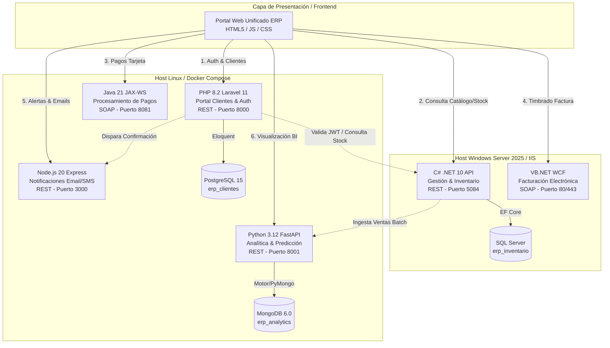
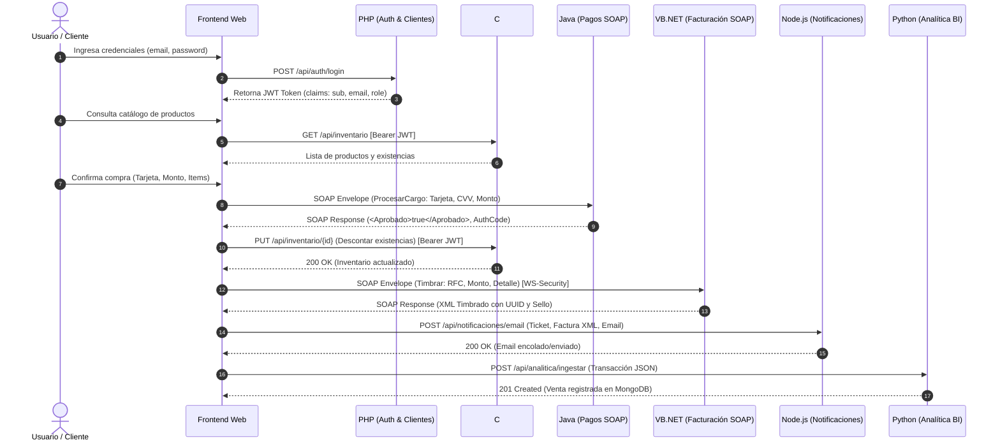

# Arquitectura General del Sistema ERP Retail Distribuido (v2)

Este documento define la arquitectura integral, topología de servicios, modelo de integración, seguridad y estructura de repositorio para el **Sistema ERP Retail Distribuido**, consolidando la interoperabilidad entre arquitecturas **RESTful** y **SOAP** a través de 6 microservicios y múltiples motores de bases de datos.

---

## 1. Visión General del Sistema

El ERP Retail simula un ecosistema comercial heterogéneo que acopla:
- **Ecosistema Propietario (Windows / IIS):** Servicios de misión crítica e inventario corporativo desarrollados en tecnologías Microsoft (.NET 10 y VB.NET WCF).
- **Ecosistema Software Libre (Linux / Docker):** Servicios ágiles, portales públicos, analítica y notificaciones (PHP Laravel, Python FastAPI, Node.js Express y Java JAX-WS).



---

## 2. Matriz de Microservicios, Protocolos e Infraestructura

| Microservicio | Responsabilidad | Paradigma | Protocolo / Formato | Puerto Host | Almacenamiento | Host de Despliegue |
| :--- | :--- | :--- | :--- | :--- | :--- | :--- |
| **Portal Clientes & Auth** | Autenticación, JWT, perfil del cliente y puntos de lealtad | RESTful | HTTP / JSON | `8000` | PostgreSQL 15 | Linux (Docker) |
| **Gestión e Inventario** | Catálogo de productos, stock en sucursales y CRUD de mercancía | RESTful | HTTP / JSON | `5084` | SQL Server | Windows Server 2025 (IIS) |
| **Procesamiento de Pagos** | Pasarela transaccional bancaria simulada | SOAP | XML / WSDL | `8081` | En memoria / Transaccional | Linux (Docker) |
| **Facturación Electrónica** | Timbrado fiscal de comprobantes de venta | SOAP | XML / WCF (WS-Security) | `80` / `443` | XML Filesystem | Windows Server 2025 (IIS) |
| **Notificaciones** | Envío de correos de confirmación y SMS | RESTful | HTTP / JSON | `3000` | Stateless (SMTP mock) | Linux (Docker) |
| **Analítica y Predicción** | Ingesta masiva de transacciones y pronósticos de stock | RESTful | HTTP / JSON | `8001` | MongoDB 6.0 | Linux (Docker) |
| **Frontend Web** | Interfaz unificada de compra y administración | SPA/Modular | HTTP / Browser fetch | `8080` / `5500`| LocalStorage (JWT) | Nginx / IIS / Static Host |

---

## 3. Flujo de Integración End-to-End (Caso de Uso de Compra)

El siguiente diagrama detalla la orquestación secuencial de los 6 microservicios durante una transacción de compra:



---

## 4. Modelo de Seguridad y Autenticación

### 4.1. Seguridad REST (JSON Web Tokens - JWT)
1. **Emisor Central:** `php-laravel` mediante `tymon/jwt-auth`.
2. **Algoritmo:** HMAC SHA-256 (`HS256`) con clave secreta compartida (`JWT_SECRET`).
3. **Mecanismo de Propagación:** Cabecera HTTP estándar:
   ```http
   Authorization: Bearer <token_jwt>
   ```
4. **Validadores:**
   - **C# .NET 10:** Middleware `Microsoft.AspNetCore.Authentication.JwtBearer` validando `IssuerSigningKey`, `ValidateIssuer = false`, `ValidateAudience = false`.
   - **Python FastAPI:** Dependencia de seguridad OAuth2 Bearer validando con `pyjwt` o `jose`.
   - **Node.js Express:** Middleware `jsonwebtoken` validando token en rutas protegidas.

### 4.2. Seguridad SOAP (WS-Security)
1. **Servicio Facturación (`VB.NET WCF`):**
   - Configuración `wsHttpBinding` o `basicHttpBinding` con `MessageSecurity / TransportWithMessageCredential`.
   - Perfil `UsernameToken`: Validación de usuario y contraseña en el encabezado `<wsse:Security>`.
2. **Servicio Pagos (`Java JAX-WS`):**
   - Validación de cabecera SOAP o token bancario interno para autorizar el cargo.

---

## 5. Estructura de Directorios Raíz del Proyecto

Para permitir tanto el desarrollo desacoplado como la orquestación centralizada, se establece la siguiente estructura de carpetas:

```text
servicios-web-erp/
├── backend/
│   ├── csharp-inventario/        # Microservicio C# .NET 10 (REST)
│   │   ├── Controllers/
│   │   ├── Data/
│   │   ├── Models/
│   │   └── Program.cs
│   ├── vbnet-facturacion/        # Microservicio VB.NET WCF (SOAP)
│   │   ├── IFacturacion.vb
│   │   ├── FacturacionService.svc
│   │   └── Web.config
│   ├── java-pagos/               # Microservicio Java 21 JAX-WS (SOAP)
│   │   ├── src/main/java/com/erp/pagos/
│   │   ├── pom.xml
│   │   └── Dockerfile
│   ├── php-clientes/             # Microservicio PHP 8.2 Laravel 11 (REST)
│   │   ├── app/Http/Controllers/
│   │   ├── routes/api.php
│   │   └── Dockerfile
│   ├── python-analitica/         # Microservicio Python 3.12 FastAPI (REST)
│   │   ├── app/
│   │   ├── requirements.txt
│   │   └── Dockerfile
│   ├── node-notificaciones/      # Microservicio Node.js 20 Express (REST)
│   │   ├── src/
│   │   ├── package.json
│   │   └── Dockerfile
│   └── docker-compose.yml        # Orquestador del ecosistema Linux
│
├── frontend/
│   ├── index.html                # Punto de entrada de la aplicación web
│   ├── css/
│   │   ├── main.css              # Sistema de diseño, CSS variables y layout
│   │   └── components.css        # Modales, tablas, tarjetas y badges
│   ├── js/
│   │   ├── app.js                # Enrutamiento, estado global y ciclo de vida
│   │   ├── config.js             # Mapeo de URLs, puertos y endpoints
│   │   ├── auth.js               # Manejo de sesión, login y tokens JWT
│   │   ├── services/             # Clientes HTTP y SOAP por microservicio
│   │   │   ├── authService.js    # Consumo de PHP (Puerto 8000)
│   │   │   ├── inventoryService.js # Consumo de C# (Puerto 5084)
│   │   │   ├── paymentService.js # Consumo SOAP Java (Puerto 8081)
│   │   │   ├── invoiceService.js # Consumo SOAP VB.NET (Puerto 80/443)
│   │   │   ├── notifyService.js  # Consumo Node.js (Puerto 3000)
│   │   │   └── analyticsService.js# Consumo Python (Puerto 8001)
│   │   └── views/                # Renderizadores modulares de pantalla
│   │       ├── catalogView.js
│   │       ├── checkoutView.js
│   │       ├── adminView.js
│   │       └── analyticsView.js
│   └── assets/                   # Iconos, imágenes y recursos estáticos
│
├── docs/
│   ├── arquitectura.md           # Este documento maestro de arquitectura
│   ├── backend.md                # Especificación técnica exhaustiva de Backend
│   └── frontend.md               # Especificación técnica exhaustiva de Frontend
│
└── especificaci_n_t_cnica_completa_erp_v2.md # Documento base del requerimiento
```

---

## 6. Consideraciones de Red y Políticas CORS

Dado que el navegador ejecuta el cliente Frontend consumiendo múltiples orígenes locales:
1. **Configuración CORS en Servicios REST:**
   - Permitir orígenes: `http://localhost:*`, `http://127.0.0.1:*`.
   - Headers permitidos: `Content-Type`, `Authorization`, `Accept`.
   - Métodos permitidos: `GET`, `POST`, `PUT`, `DELETE`, `OPTIONS`.
2. **Consumo de Servicios SOAP desde el Frontend:**
   - Los servicios SOAP (Java y VB.NET) deben habilitar cabeceras CORS en sus contenedores/servidores web para permitir peticiones `POST` con `Content-Type: text/xml; charset=utf-8` o `application/soap+xml`.
   - De forma alternativa, el backend Node.js o PHP puede actuar opcionalmente como API Gateway proxy hacia los contratos SOAP si las restricciones del navegador lo requieren.
