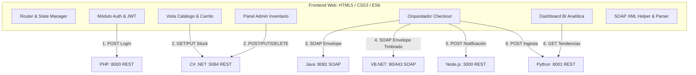

# Especificación Técnica de Frontend: Portal Web Unificado ERP (v2)

Este documento define la arquitectura, diseño de interfaz, estructura de código y mecanismos de integración del **Cliente Frontend** del Sistema ERP Retail Distribuido. Su propósito es orquestar y consumir los 6 microservicios (RESTful y SOAP) en una experiencia de usuario fluida, moderna y desacoplada.

---

## 1. Visión y Arquitectura del Frontend

El cliente frontend está concebido como una aplicación web modular en **HTML5, Vanilla CSS y JavaScript moderno (ES6+ Modules)**. Esta elección garantiza:
- Cero dependencias complejas de compilación para máxima portabilidad académica e industrial.
- Capacidad nativa para realizar peticiones HTTP RESTful (`fetch` / JSON) y peticiones SOAP (`fetch` / XML con envelopes personalizados).
- Despliegue estático ultra-rápido en Nginx, IIS o servidores locales de desarrollo (puerto `8080` / `5500`).



---

## 2. Estructura de Directorios del Frontend

```text
frontend/
├── index.html                    # Single Page Interface con contenedores de vistas
├── css/
│   ├── main.css                  # Variables de tema, reset, tipografía y grid
│   ├── components.css            # Botones, modales, toasts, badges y tablas
│   └── views.css                 # Estilos específicos de catálogo, checkout y dashboard
├── js/
│   ├── config.js                 # URLs base de los 6 microservicios
│   ├── state.js                  # Estado global (usuario actual, carrito, tokens)
│   ├── app.js                    # Inicialización y navegación por pestañas/vistas
│   │
│   ├── services/                 # Capa de comunicación con los microservicios
│   │   ├── httpClient.js         # Wrapper fetch con inyección automática de JWT
│   │   ├── soapClient.js         # Constructor y parser de sobres SOAP XML
│   │   ├── authService.js        # Comunicación con PHP Laravel (:8000)
│   │   ├── inventoryService.js   # Comunicación con C# .NET 10 (:5084)
│   │   ├── paymentService.js     # Comunicación SOAP con Java (:8081)
│   │   ├── invoiceService.js     # Comunicación SOAP con VB.NET WCF (:80/:443)
│   │   ├── notifyService.js      # Comunicación con Node.js Express (:3000)
│   │   └── analyticsService.js   # Comunicación con Python FastAPI (:8001)
│   │
│   ├── components/               # Componentes reusables de interfaz
│   │   ├── navbar.js             # Barra superior con estado de usuario y carrito
│   │   ├── modal.js              # Manejador de ventanas modulares emergentes
│   │   └── toast.js              # Alertas flotantes de éxito/error
│   │
│   └── views/                    # Lógica de renderizado de cada módulo
│       ├── loginModal.js         # Modal de inicio de sesión
│       ├── catalogView.js        # Listado de productos y botón añadir al carrito
│       ├── checkoutModal.js      # Formulario de pago y barra de progreso transaccional
│       ├── invoiceModal.js       # Visor del comprobante fiscal XML timbrado
│       ├── adminInventoryView.js # ABM / CRUD de productos para administradores
│       └── analyticsDashboardView.js # Gráficas y recomendaciones de stock
└── assets/
    └── img/                      # Logotipos e iconos
```

---

## 3. Configuración Centralizada (`js/config.js`)

Centraliza las rutas base hacia todos los servicios para facilitar cambios entre entornos local, Docker y producción:

```javascript
export const CONFIG = {
  SERVICES: {
    AUTH_PHP: 'http://localhost:8000/api',         // Laravel (PostgreSQL)
    INVENTORY_CSHARP: 'http://localhost:5084/api', // ASP.NET Core (SQL Server)
    PAYMENTS_JAVA: 'http://localhost:8081/ws/pagos', // JAX-WS SOAP
    INVOICE_VBNET: 'http://localhost/FacturacionService.svc', // WCF SOAP
    NOTIFICATIONS_NODE: 'http://localhost:3000/api', // Express.js
    ANALYTICS_PYTHON: 'http://localhost:8001/api'  // FastAPI (MongoDB)
  },
  STORAGE_KEYS: {
    TOKEN: 'erp_jwt_token',
    USER: 'erp_user_data',
    CART: 'erp_shopping_cart'
  }
};
```

---

## 4. Estrategia de Consumo e Integración de Servicios

### 4.1. Consumo de Servicios REST con JWT Compartido (`js/services/httpClient.js`)
Todas las llamadas hacia C# .NET, Python y Node.js inyectan automáticamente el token emitido por PHP Laravel:

```javascript
import { CONFIG } from '../config.js';

export async function apiFetch(url, options = {}) {
  const token = localStorage.getItem(CONFIG.STORAGE_KEYS.TOKEN);
  const headers = {
    'Content-Type': 'application/json',
    ...(token ? { 'Authorization': `Bearer ${token}` } : {}),
    ...options.headers
  };

  const response = await fetch(url, { ...options, headers });
  
  if (response.status === 401) {
    localStorage.removeItem(CONFIG.STORAGE_KEYS.TOKEN);
    window.dispatchEvent(new CustomEvent('auth:expired'));
    throw new Error('Sesión expirada o no autorizada');
  }
  
  return response;
}
```

---

### 4.2. Consumo Directo de Servicios SOAP desde JavaScript (`js/services/soapClient.js`)

El frontend cuenta con un adaptador nativo capaz de construir envelopes XML válidos para los servicios JAX-WS y WCF.

#### A. Consumo de Pagos (Java JAX-WS - Puerto 8081)
```javascript
export async function procesarCargoSoap({ numeroTarjeta, cvv, monto, fechaExpiracion }) {
  const soapEnvelope = `<?xml version="1.0" encoding="utf-8"?>
<soapenv:Envelope xmlns:soapenv="http://schemas.xmlsoap.org/soap/envelope/" xmlns:pag="http://pagos.erp.com/">
  <soapenv:Header/>
  <soapenv:Body>
    <pag:ProcesarCargo>
      <NumeroTarjeta>${numeroTarjeta}</NumeroTarjeta>
      <CVV>${cvv}</CVV>
      <Monto>${monto}</Monto>
      <FechaExpiracion>${fechaExpiracion}</FechaExpiracion>
    </pag:ProcesarCargo>
  </soapenv:Body>
</soapenv:Envelope>`;

  const response = await fetch(CONFIG.SERVICES.PAYMENTS_JAVA, {
    method: 'POST',
    headers: {
      'Content-Type': 'text/xml; charset=utf-8',
      'SOAPAction': '""'
    },
    body: soapEnvelope
  });

  const xmlText = await response.text();
  const parser = new DOMParser();
  const xmlDoc = parser.parseFromString(xmlText, 'text/xml');

  return {
    aprobado: xmlDoc.getElementsByTagName('Aprobado')[0]?.textContent === 'true',
    autorizacion: xmlDoc.getElementsByTagName('NumeroAutorizacion')[0]?.textContent || '',
    mensaje: xmlDoc.getElementsByTagName('Mensaje')[0]?.textContent || ''
  };
}
```

#### B. Consumo de Facturación con WS-Security (VB.NET WCF - Puerto 80/443)
```javascript
export async function timbrarFacturaSoap({ rfc, razonSocial, montoTotal, subtotal, iva, conceptos, username, password }) {
  const soapEnvelope = `<?xml version="1.0" encoding="utf-8"?>
<soapenv:Envelope xmlns:soapenv="http://schemas.xmlsoap.org/soap/envelope/" xmlns:fac="http://erp.retail.com/facturacion">
  <soapenv:Header>
    <wsse:Security xmlns:wsse="http://docs.oasis-open.org/wss/2004/01/oasis-200401-wss-wssecurity-secext-1.0.xsd">
      <wsse:UsernameToken>
        <wsse:Username>${username}</wsse:Username>
        <wsse:Password>${password}</wsse:Password>
      </wsse:UsernameToken>
    </wsse:Security>
  </soapenv:Header>
  <soapenv:Body>
    <fac:Timbrar>
      <fac:request>
        <fac:RfcReceptor>${rfc}</fac:RfcReceptor>
        <fac:RazonSocial>${razonSocial}</fac:RazonSocial>
        <fac:MontoTotal>${montoTotal}</fac:MontoTotal>
        <fac:Subtotal>${subtotal}</fac:Subtotal>
        <fac:Iva>${iva}</fac:Iva>
        <fac:Conceptos>
          ${conceptos.map(c => `
            <fac:ConceptoItem>
              <fac:Cantidad>${c.cantidad}</fac:Cantidad>
              <fac:Descripcion>${c.descripcion}</fac:Descripcion>
              <fac:PrecioUnitario>${c.precioUnitario}</fac:PrecioUnitario>
            </fac:ConceptoItem>
          `).join('')}
        </fac:Conceptos>
      </fac:request>
    </fac:Timbrar>
  </soapenv:Body>
</soapenv:Envelope>`;

  const response = await fetch(CONFIG.SERVICES.INVOICE_VBNET, {
    method: 'POST',
    headers: {
      'Content-Type': 'text/xml; charset=utf-8',
      'SOAPAction': 'http://erp.retail.com/facturacion/IFacturacion/Timbrar'
    },
    body: soapEnvelope
  });

  const xmlText = await response.text();
  const xmlDoc = new DOMParser().parseFromString(xmlText, 'text/xml');

  return {
    exitoso: xmlDoc.getElementsByTagName('Exitoso')[0]?.textContent === 'true',
    uuid: xmlDoc.getElementsByTagName('UuidFolioFiscal')[0]?.textContent || '',
    sello: xmlDoc.getElementsByTagName('SelloDigitalSAT')[0]?.textContent || '',
    xmlComprobante: xmlDoc.getElementsByTagName('XmlComprobante')[0]?.textContent || ''
  };
}
```

---

## 5. Módulos y Vistas de la Interfaz

### 5.1. Módulo de Autenticación & Perfil
- Modal interactivo de Login conectado a `POST /api/auth/login` (Laravel).
- Almacenamiento seguro del JWT en `localStorage`.
- Despliegue de puntos de lealtad obtenidos desde `GET /api/clientes/perfil`.

### 5.2. Módulo de Catálogo & Carrito
- Cuadrícula responsiva de tarjetas de productos obtenidas en tiempo real de C# .NET (`GET /api/inventario`).
- Badge dinámico con indicador de existencias por sucursal.
- Carrito flotante con cálculo reactivo de Subtotal, IVA (16%) y Total.

### 5.3. Orquestador del Checkout (Paso a Paso Visual)
Al pulsar "Proceder al Pago", la interfaz despliega un stepper visual con retroalimentación en tiempo real de los 5 pasos:

1. **Paso 1: Cobro Bancario (Java SOAP):** Ejecuta `ProcesarCargo`. Muestra spinner con texto *"Conectando con pasarela bancaria JAX-WS..."*.
2. **Paso 2: Timbrado Fiscal (VB.NET SOAP):** Si el pago es aprobado, ejecuta `Timbrar`. Muestra *"Emitiendo CFDI fiscal ante WCF con WS-Security..."*.
3. **Paso 3: Actualización de Inventario (C# REST):** Llama a `PUT /api/inventario/{id}` para descontar el stock vendido.
4. **Paso 4: Notificaciones (Node.js REST):** Envía correo con `POST /api/notificaciones/email` adjuntando el folio fiscal y XML.
5. **Paso 5: Registro Analítico (Python REST):** Envía en segundo plano la transacción a `POST /api/analitica/ingestar`.
6. **Fin del Proceso:** Muestra ticket de compra, UUID fiscal timbrado y opción de descarga del XML.

### 5.4. Panel Administrativo de Inventario (C# .NET)
- Tabla con paginación y búsqueda rápida de productos.
- Formulario modal para dar de alta nuevo producto y stock (`POST /api/inventario`).
- Edición rápida de precio y cantidad (`PUT /api/inventario/{id}`).
- Eliminación con confirmación (`DELETE /api/inventario/{id}`).

### 5.5. Dashboard de Analítica y Predicciones (Python FastAPI)
- Gráficas de tendencias de ventas y demanda proyectada por producto/sucursal (`GET /api/analitica/tendencias`).
- Indicadores visuales de alertas de desabasto (KPIs en rojo/ámbar/verde) calculados por el motor predictivo de Python.

---

## 6. Sistema de Diseño Visual y Estilo

- **Paleta de Colores:**
  - Fondo principal: `#0f172a` (Slate oscuro moderno).
  - Superficies y tarjetas: `#1e293b` con bordes sutiles `#334155`.
  - Primario de acción: `#3b82f6` (Azul vibrante).
  - Éxito / Aprobado: `#10b981` (Esmeralda).
  - Advertencia / Alerta: `#f59e0b` (Ámbar).
  - Peligro / Rechazado: `#ef4444` (Rojo).
- **Tipografía:** *Inter*, *system-ui*, sans-serif.
- **Efectos:** Glassmorphism moderado en barras y modales (`backdrop-filter: blur(12px)`), transiciones suaves de 200ms en hover de botones y tarjetas.
